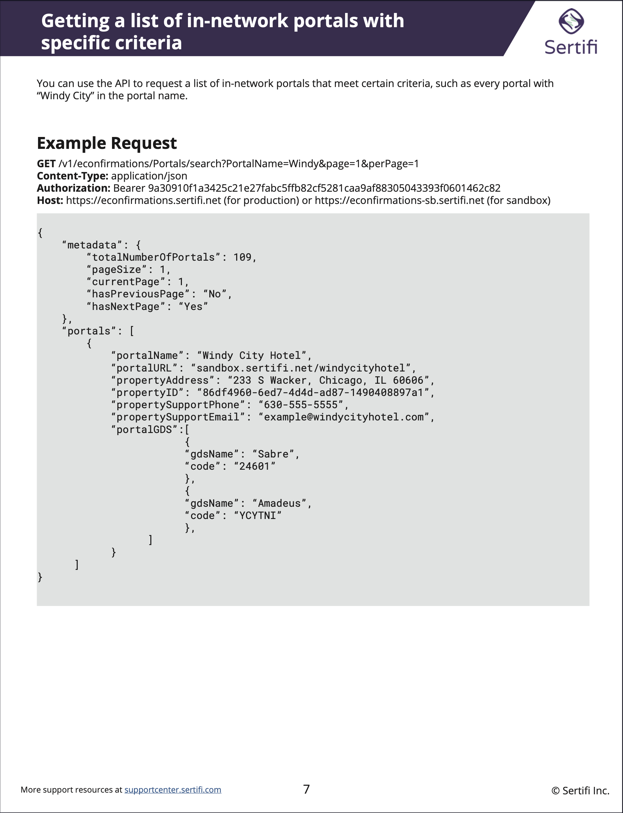

# Portfolio
{: .no_toc }

## Table of contents
{: .no_toc }

- Support Documentation
{:toc}

## Support Documenation

### Support Site
{: .no_toc }

As part of the leadup to Sertifi launching new versions of their core products, I completely rebuilt the support center with materials for these new versions, in addition to improving the deployment times, readability, and accessibility of customer documentation. This process included writing custom CSS and JavaScript in order to make the site match company branding, as well as adding functionality and navigation improvements. The site was made using [Paligo](https://www.paligo.net).

[View the live site here.](https://supportcenter.sertifi.com/?lang=en)

### Code Sample PDF
{: .no_toc }

### Flowchart
{: .no_toc }

This is a flowchart demonstrating how users can create rules, or rule expressions, to determine how their data leak prevention (DLP) policies would be automatically enforced on files within their storage systems.

## REST APIs

I [created a documentation site for Sertifi's REST API](https://sertifi.readme.io/) that let users run test calls against their own production environments, in addition to generating sample calls in various programming languages.

I also created sample recipes to demonstrate common API workflows.

## Video Guides
These videos were written, produced, edited, and voiced by me, through a combination of Adobe Audition, Adobe Premiere Pro, and Adobe AfterEffects.

### Guide Video Demo (Short)
{: .no_toc }

This is an example of short, one-topic videos designed to answer common questions.

<iframe src="https://player.vimeo.com/video/897250205?badge=0&amp;autopause=0&amp;player_id=0&amp;app_id=58479" frameborder="0" allow="autoplay; fullscreen; picture-in-picture" style="position:absolute;top:0;left:0;width:100%;height:100%;" title="Guide Video Demo (Short)"></iframe>

### Step-by-Step Tutorial Video (Long)
{: .no_toc }

This was produced for an audience who may be using the product for the first time, or needing to get an overview of basic functions and features.

<iframe src="https://player.vimeo.com/video/900194768?badge=0&amp;autopause=0&amp;player_id=0&amp;app_id=58479" frameborder="0" allow="autoplay; fullscreen; picture-in-picture" style="position:absolute;top:0;left:0;width:100%;height:100%;" title="Guide Video Demo (Long)"></iframe>

