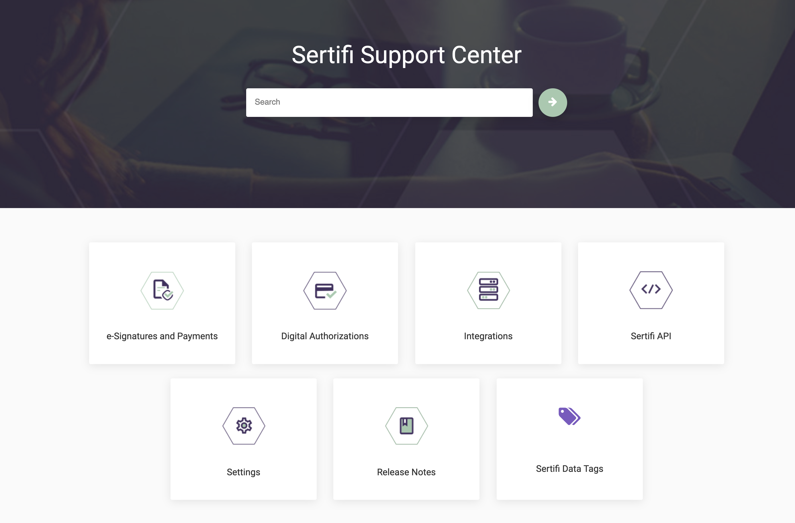
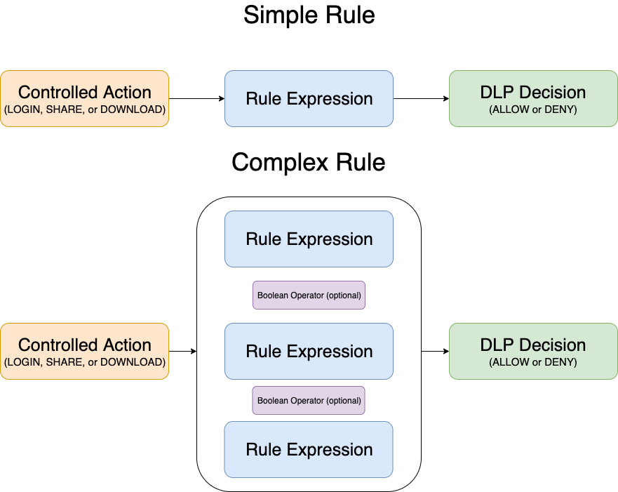
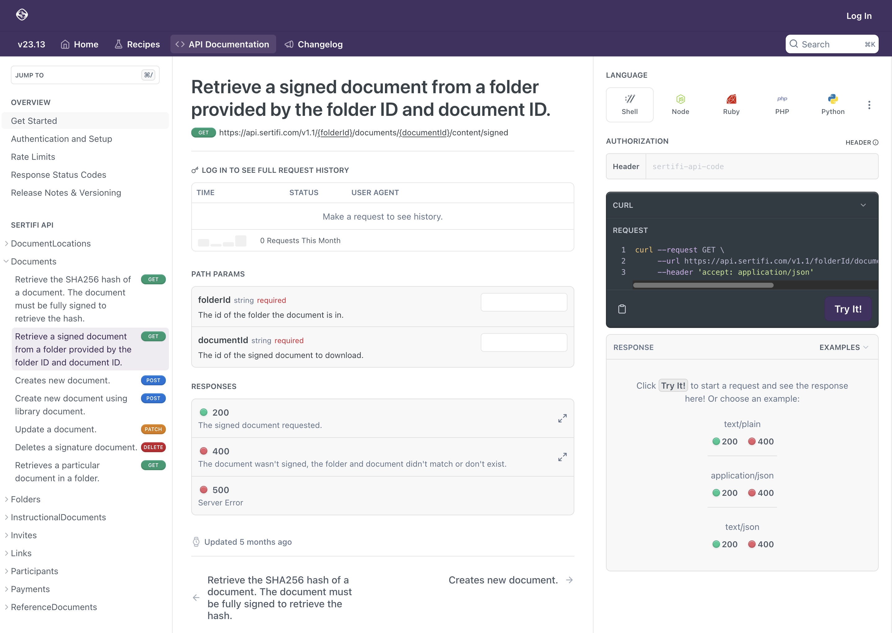
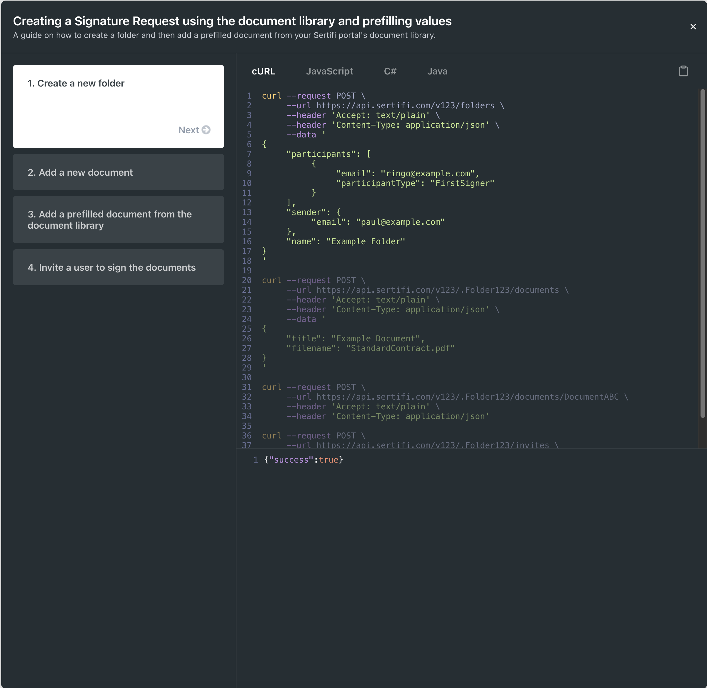

## Table of contents
{: .no_toc }

- Support Documentation
{:toc}

## Support Documenation

### Support Center
{: .no_toc}

As part of the leadup to Sertifi launching new versions of their core products, I completely rebuilt the support center with materials for these new versions, in addition to improving the deployment times, readability, and accessibility of customer documentation. This process included writing custom CSS and JavaScript in order to make the site match company branding, as well as adding functionality and navigation improvements. The site was made using [Paligo](https://www.paligo.net).

[View the live site here.](https://supportcenter.sertifi.com/?lang=en)

This is a flowchart demonstrating how users can create rules, or rule expressions, to determine how their data leak prevention (DLP) policies would be automatically enforced on files within their storage systems.

## API Documentation

With the [Readme](https://readme.com/) tool, I created a documentation site for Sertifi's REST API that let users run test calls against their own production environments, in addition to generating sample calls in various programming languages.

I also created sample recipes to demonstrate common API workflows.

<!-- ## UX Writing -->
